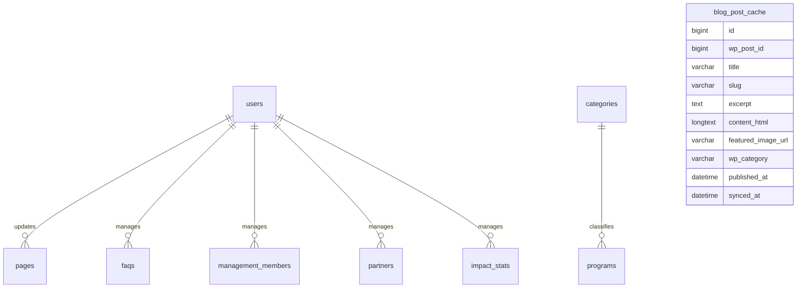

# ERD — Company Profile Insani Indonesia

**Version:** 1.1 (Rekonsiliasi pasca-review Antigravity — Headless WordPress dipertahankan, tambah Homepage Banner & Contact Message)
**Mengacu pada:** PRD_COMPANY_PROFILE_v1_0.md, dan ERD_v1_0.md v1.1 (Galang Dana) untuk entitas yang di-reuse
**Stack:** Laravel 13, MySQL 8, Inertia.js, React, Tailwind CSS (TailAdmin v2.3), Spatie Permission, Spatie Activitylog, Spatie Translatable, WordPress (headless)

---

# 1. Domain Overview

Proyek ini menambahkan **7 domain baru** ke skema database yang sudah ada dari Galang Dana (bukan database terpisah — 1 database yang sama):

1. Static Pages (Tentang, Legal, Logo Kit)
2. FAQ
3. Management Profile (Manajemen/Pengurus)
4. Partners (Mitra)
5. Impact Statistics (Insani Dalam Angka)
6. Blog Cache (integrasi headless WordPress)
7. Homepage Banner & Contact Message (etalase beranda & form kontak)

**Perluasan skema existing:** tabel `categories` (dari Galang Dana) mendapat 2 kolom baru untuk merangkap fungsi "Fokus Program" — lihat Section 3.

---

# 2. High Level ERD (Domain Baru)



> **Catatan:** `blog_post_cache` sengaja **tidak** punya relasi FK ke tabel manapun di Laravel — ia murni cache read-only dari sistem eksternal (WordPress), diidentifikasi lewat `wp_post_id` sebagai sumber kebenaran di sisi WordPress, bukan lewat foreign key relasional.

---

# 3. Perluasan Tabel `categories` (dari Galang Dana)

Tabel `categories` **sudah ada** (lihat ERD Galang Dana v1.0 Section 5). Kolom baru ditambahkan via migration terpisah di proyek ini:

| Field Baru | Type | Keterangan |
|---|---|---|
| is_focus_program | boolean | Default `false`. Menandai kategori yang tampil sebagai pilar strategis di homepage/Fokus Program |
| pillar_image | varchar(255) NULLABLE | Gambar banner besar untuk tampilan pilar (beda dari `icon` yang untuk chip kecil) |

**Relasi tidak berubah** — `categories` tetap `hasMany` ke `programs` seperti sebelumnya. Field baru ini murni penanda tampilan, tidak menambah relasi baru.

```php
// Category model — method baru
Category::scopeFocusProgram($query) // WHERE is_focus_program = true, ORDER BY sort_order
```

---

# 4. Static Pages Domain

## pages

Konten halaman statis (Tentang Insani, Logo Kit, dan opsional Visi-Misi jika berkembang di luar `app_settings`).

```text
Page
 └── belongsTo User (updated_by)
```

| Field | Type | Keterangan |
|---|---|---|
| id | bigint | |
| slug | varchar(120), UNIQUE | mis. `tentang-insani`, `logo-kit` |
| title | JSON (translatable) | |
| content | JSON (translatable) | Rich text |
| meta_description | JSON (translatable) NULLABLE | Untuk SEO |
| attachment_path | varchar(255) NULLABLE | Khusus halaman Logo Kit (file ZIP/asset unduhan) |
| updated_by | bigint, FK → users.id | |
| created_at / updated_at | timestamp | |

---

# 5. FAQ Domain

## faqs

```text
Faq
 └── belongsTo User (updated_by)
```

| Field | Type | Keterangan |
|---|---|---|
| id | bigint | |
| question | JSON (translatable) | |
| answer | JSON (translatable) | |
| sort_order | integer | |
| is_active | boolean | |
| updated_by | bigint, FK → users.id | |
| created_at / updated_at | timestamp | |

---

# 6. Management Profile Domain

## management_members

```text
ManagementMember
 └── belongsTo User (updated_by)
```

| Field | Type | Keterangan |
|---|---|---|
| id | bigint | |
| name | varchar(255) | Tidak perlu terjemahan |
| position | JSON (translatable) | Jabatan — perlu terjemahan |
| photo | varchar(255) | |
| bio | JSON (translatable) NULLABLE | |
| linkedin_url | varchar(255) NULLABLE | |
| instagram_url | varchar(255) NULLABLE | |
| sort_order | integer | |
| is_active | boolean | |
| updated_by | bigint, FK → users.id | |
| created_at / updated_at | timestamp | |

---

# 7. Partners Domain

## partners

```text
Partner
 └── belongsTo User (updated_by)
```

| Field | Type | Keterangan |
|---|---|---|
| id | bigint | |
| name | varchar(255) | |
| logo | varchar(255) | |
| website_url | varchar(255) NULLABLE | |
| sort_order | integer | |
| is_active | boolean | |
| updated_by | bigint, FK → users.id | |
| created_at / updated_at | timestamp | |

---

# 8. Impact Statistics Domain

## impact_stats

Statistik "Insani Dalam Angka" — **input manual**, bukan hasil kalkulasi otomatis (lihat PRD Section 7.4).

```text
ImpactStat
 └── belongsTo User (updated_by)
```

| Field | Type | Keterangan |
|---|---|---|
| id | bigint | |
| group | enum('dalam_negeri','luar_negeri','umum') | Pengelompokan tampilan |
| label | JSON (translatable) | mis. "Program Terlaksana" |
| value | varchar(50) | Disimpan sebagai string, bukan angka murni — mendukung format seperti "1.2K+" atau "48.435" |
| icon | varchar(100) NULLABLE | |
| sort_order | integer | |
| is_active | boolean | |
| updated_by | bigint, FK → users.id | |
| created_at / updated_at | timestamp | |

---

# 9. Homepage Banner & Contact Message Domain

## homepage_banners

Slider banner utama halaman Beranda.

```text
HomepageBanner
 └── belongsTo User (updated_by)
```

| Field | Type | Keterangan |
|---|---|---|
| id | bigint | |
| title | varchar(255) NULLABLE | Judul internal, bukan translatable — murni label untuk staff |
| image_desktop | varchar(255) | |
| image_mobile | varchar(255) NULLABLE | Fallback ke `image_desktop` jika kosong |
| link_url | varchar(255) NULLABLE | Tujuan CTA saat banner diklik |
| sort_order | integer | |
| is_active | boolean | |
| updated_by | bigint, FK → users.id | |
| created_at / updated_at | timestamp | |

## contact_messages

Pesan masuk dari form "Hubungi Kami" publik.

```text
ContactMessage
 └── belongsTo User (read_by)
```

| Field | Type | Keterangan |
|---|---|---|
| id | bigint | |
| name | varchar(255) | |
| email | varchar(255) | |
| subject | varchar(255) | |
| message | text | |
| is_read | boolean | Default `false` |
| read_by | bigint NULLABLE, FK → users.id | Staff (CS/Content Editor) yang membaca |
| read_at | datetime NULLABLE | |
| created_at / updated_at | timestamp | |

**Business Rule:** Submission form wajib lolos validasi anti-spam (Honeypot/Turnstile) di level Form Request **sebelum** insert ke tabel ini — lihat PRD Section 7.5. Notifikasi email ke Administrator/CS dikirim otomatis setiap ada baris baru (via Observer atau langsung di controller).

---

# 10. Blog Cache Domain (Headless WordPress)

## blog_post_cache

Cache lokal artikel dari WordPress — satu-satunya sumber data yang dibaca halaman publik `/kabar`, **tidak pernah** query langsung ke WordPress saat request publik masuk.

```text
BlogPostCache
 (tidak ada relasi FK — identifikasi via wp_post_id)
```

| Field | Type | Keterangan |
|---|---|---|
| id | bigint | |
| wp_post_id | bigint, UNIQUE | ID post di sisi WordPress — kunci pencocokan saat sync/upsert |
| title | varchar(255) | **Bahasa Indonesia saja**, tidak translatable (lihat PRD Section 2) |
| slug | varchar(255), UNIQUE | |
| excerpt | text NULLABLE | |
| content_html | longtext | **Wajib disanitasi** via `mews/purifier` sebelum disimpan (lihat PRD Section 7.1) |
| featured_image_url | varchar(255) NULLABLE | URL gambar dari WP Media Library |
| wp_category | varchar(100) NULLABLE | Nama kategori dari WordPress (string sederhana, bukan FK — WordPress adalah sumber kebenaran taksonomi blog) |
| published_at | datetime | Tanggal publish asli dari WordPress |
| synced_at | datetime | Kapan terakhir kali disinkronkan dari WordPress |
| created_at / updated_at | timestamp | |

**Business Rule — Sinkronisasi:**
- Insert/update dilakukan via `upsert` berbasis `wp_post_id` — jika post sudah ada (`wp_post_id` cocok), data di-update; jika belum ada, insert baru
- Entri dihapus dari `blog_post_cache` jika post yang bersangkutan sudah tidak ditemukan lagi saat full-sync (artinya di-unpublish/dihapus dari WordPress)

---

# 11. Core Business Rules (Ringkasan)

| Domain | Rule |
|---|---|
| Categories (perluasan) | `is_focus_program`/`pillar_image` bisa diubah Administrator **maupun** Content Editor; field lain tetap eksklusif Administrator |
| Blog Cache | Sumber kebenaran taksonomi & konten tetap WordPress; Laravel hanya cache read-only, disanitasi sebelum disimpan |
| Impact Stats | Selalu input manual, tidak pernah dihitung otomatis dari `donations` |
| Static Pages/FAQ/Management/Partners | Seluruhnya translatable (JSON, `spatie/laravel-translatable`) kecuali field yang secara alami tidak perlu terjemahan (`name`, `photo`, `logo`, `website_url`) |
| Contact Message | Wajib lolos anti-spam (Honeypot/Turnstile) sebelum insert; trigger notifikasi email otomatis ke staff |
| Homepage Banner | `image_mobile` fallback otomatis ke `image_desktop` jika kosong — tidak boleh ada banner tanpa gambar sama sekali |

---

# 12. Estimated Table Count (Tambahan dari Proyek Ini)

## Business Tables Baru (8)

```text
pages
faqs
management_members
partners
impact_stats
blog_post_cache
homepage_banners
contact_messages
```

## Perluasan Tabel Existing (bukan tabel baru)

```text
categories  (+2 kolom: is_focus_program, pillar_image)
```

## Grand Total Database (Galang Dana v1.1 + Company Profile)

```text
23 tabel (Galang Dana v1.1: 14 bisnis + 6 package + 3 framework)
 + 8 tabel baru (Company Profile)
 = 31 tabel
```
