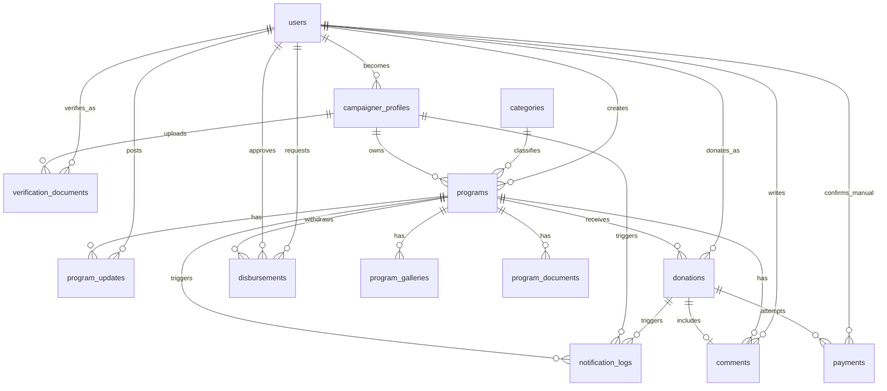
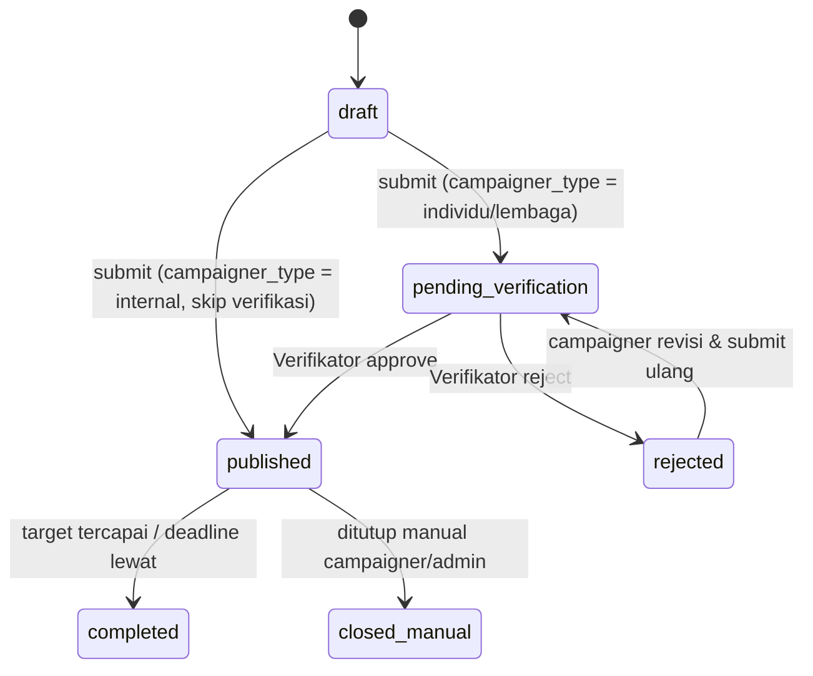

# ERD — Galang Dana Insani Indonesia (GDII)

**Version:** 1.1 (Synced with PRD v1.1)
**Mengacu pada:** PRD_v1_0.md (v1.1 — Open Questions Resolved)
**Stack:** Laravel 13, MySQL 8, Inertia.js, React, Tailwind CSS (TailAdmin v2.3), Spatie Permission, Spatie Activitylog, Spatie Translatable, Xendit

---

# 1. Domain Overview

Sistem dibagi menjadi 8 domain utama:

1. Authentication & Authorization
2. Campaigner & Verification (Individu / Lembaga)
3. Master Data (Category)
4. Program / Campaign
5. Donation & Payment (Xendit)
6. Disbursement (Pencairan Dana)
7. Engagement (Program Update, Comment)
8. System (Settings, Notification Log, Audit Log)

---

# 2. High Level ERD (Lengkap)



---

# 3. Authentication & Authorization Domain

## users

Satu tabel untuk **semua** tipe pengguna: staff internal Insani, donatur, dan campaigner (individu/lembaga). Tipe & hak akses ditentukan oleh **role** (Spatie Permission). **Keputusan desain:** tidak ada kolom `role` atau `type` di tabel `users` — seluruh penentuan peran dikelola sepenuhnya oleh package `spatie/laravel-permission` (tabel `model_has_roles`), agar penambahan role baru di kemudian hari tidak perlu migration ubah struktur `users`.

```text
User
 ├── Administrator          (internal)
 ├── Program Officer        (internal)
 ├── Verifikator             (internal)
 ├── Keuangan                (internal)
 ├── Customer Service        (internal)
 ├── Campaigner Individu     (eksternal)
 ├── Campaigner Lembaga      (eksternal — 1 akun bisa jadi PIC, profil lembaga di campaigner_profiles)
 └── Donatur                 (eksternal — opsional, guest checkout tidak butuh akun)
```

### Relationships
- `hasOne` campaigner_profile (jika role Campaigner Individu/Lembaga)
- `hasMany` verification_documents (sebagai pengunggah dokumen, redundant tapi berguna untuk query cepat riwayat upload per user)
- `hasMany` programs (sebagai `created_by` — staff internal ATAU campaigner pemilik)
- `hasMany` program_updates (sebagai `posted_by`)
- `hasMany` donations (sebagai donatur terdaftar — nullable, guest checkout tidak terhubung ke user)
- `hasMany` disbursements (sebagai `requested_by` dan/atau `approved_by`)
- `hasMany` comments (sebagai penulis, nullable jika guest)
- `hasMany` payments (sebagai `confirmed_by` — khusus konfirmasi manual oleh CS/Keuangan)

### Authorization Tables (Spatie Permission — auto-generated)

```text
roles
permissions
model_has_roles
model_has_permissions
role_has_permissions
```

### Audit Table (Spatie Activitylog — auto-generated)

```text
activity_log
```

### Framework Tables (Laravel — auto-generated)

```text
password_reset_tokens    (fitur Lupa Password — PRD Section 13)
jobs                     (Database Queue driver — PRD Section 10.10)
failed_jobs              (Dead letter queue untuk job yang gagal)
```

---

# 4. Campaigner & Verification Domain

## campaigner_profiles

Profil tambahan untuk `users` yang menjadi campaigner. **Tidak dibuat** untuk role internal maupun Donatur murni.

```text
CampaignerProfile
 ├── belongsTo User
 ├── belongsTo User (verified_by — staff Verifikator)
 ├── hasMany VerificationDocuments
 └── hasMany Programs
```

**Field kunci per tipe:**

| Tipe | Field Wajib |
|---|---|
| `individu` | `ktp_number`, nama sesuai KTP, `bank_account_number`, `bank_account_name` (harus atas nama sendiri) |
| `lembaga` | `institution_name`, `institution_type`, `pic_name`, `npwp_number`, `sk_legalitas_number`, `bank_account_number` & `bank_account_name` (**wajib atas nama lembaga**, bukan pribadi — divalidasi manual oleh Verifikator) |

**Status verifikasi:** `pending` → `verified` / `rejected`. Setelah `verified`, bisa berubah ke `suspended` oleh Administrator (mis. ada laporan penyalahgunaan) — kondisi ini otomatis menonaktifkan kemampuan membuat program baru.

## verification_documents

Dokumen pendukung verifikasi, di-upload bertahap (bisa lebih dari satu jenis dokumen per campaigner).

```text
VerificationDocument
 └── belongsTo CampaignerProfile
```

Jenis dokumen: `ktp`, `selfie`, `sk_yayasan`, `npwp`, `buku_rekening`, `lainnya`.

**Business Rule — Validasi Bertingkat (dari PRD Section 10.1):**
- Tipe `individu`: minimal `ktp` + `selfie` ter-upload dan disetujui sebelum `campaigner_profiles.verification_status = verified`
- Tipe `lembaga`: minimal `ktp` (PIC) + `selfie` (PIC) + `sk_yayasan` + `npwp` + `buku_rekening` ter-upload dan disetujui

---

# 5. Master Data Domain

## categories

```text
Category
  └── hasMany Programs
```

| Field | Type | Keterangan |
|---|---|---|
| id | bigint | |
| name | **JSON** (translatable) | `spatie/laravel-translatable` — mis. `{"id":"Bencana Alam","ar":"...","en":"Natural Disaster"}` |
| slug | varchar(120), UNIQUE | Language-neutral, tidak per-bahasa |
| description | **JSON** (translatable) | |
| icon | varchar(100) | nama ikon (Lucide/Bootstrap Icons) untuk tampilan simbol di homepage |
| **platform_fee_percent** | decimal(5,2) | **Default `5.00`**, kategori Bencana Alam di-seed `0.00` — lihat PRD Section 10.5 |
| is_disaster_category | boolean | flag khusus untuk kategori bencana alam (memudahkan query & seeding, terpisah dari sekadar nilai fee) |
| is_active | boolean | |
| sort_order | integer | urutan tampil di chip kategori (halaman publik) |

> **Keputusan desain:** `platform_fee_percent` disimpan per kategori (bukan hardcode di kode aplikasi), sesuai catatan implementasi PRD — Administrator bisa mengubah/menambah kategori dengan fee berbeda tanpa deploy ulang.

---

# 6. Program (Campaign) Domain

## programs

Entitas inti platform — representasi 1 halaman galang dana.

```text
Program
 ├── belongsTo Category
 ├── belongsTo CampaignerProfile (nullable — NULL jika campaigner_type = internal)
 ├── belongsTo User (created_by)
 ├── belongsTo User (verified_by, nullable)
 ├── hasMany ProgramGalleries
 ├── hasMany ProgramDocuments
 ├── hasMany ProgramUpdates
 ├── hasMany Donations
 ├── hasMany Disbursements
 └── hasMany Comments
```

| Field | Type | Keterangan |
|---|---|---|
| id | bigint | |
| program_code | varchar(30), UNIQUE | |
| title | **JSON** (translatable, jika `campaigner_type = internal`) | Untuk `individu`/`lembaga`, hanya locale default (`id`) yang diisi — lihat aturan cakupan terjemahan di PRD Section 2 |
| slug | varchar(255), UNIQUE | Language-neutral, jadi 1 slug dipakai di semua prefix locale URL |
| category_id | bigint, FK | |
| campaigner_type | enum('individu','lembaga','internal') | menentukan alur verifikasi (lihat Section 8) |
| campaigner_profile_id | bigint NULLABLE, FK → campaigner_profiles.id | NULL jika `campaigner_type = internal` |
| created_by | bigint, FK → users.id | staff Program Officer ATAU user campaigner pemilik |
| verified_by | bigint NULLABLE, FK → users.id | Verifikator yang approve/reject (NULL jika internal, karena skip verifikasi) |
| target_amount | decimal(15,2) **NULLABLE** | NULL jika program tanpa target nominal (galang dana tanpa batas) |
| collected_amount | decimal(15,2) | **Cached/computed** — bukan input manual. Nilai ini di-update otomatis lewat Model Observer setiap kali ada `Payment` baru berstatus `paid` terkait program tersebut, dihitung dari `SUM(donations.amount WHERE status = paid)` |
| deadline | date NULLABLE | program bisa tanpa batas waktu |
| story | **JSON** (translatable) | deskripsi rich text — sama aturan cakupan terjemahan seperti `title` |
| cover_image | varchar(255) | |
| video_url | varchar(255) NULLABLE | |
| status | enum | lihat Section 8 |
| rejection_notes | text NULLABLE | wajib diisi Verifikator saat reject |
| published_at | datetime NULLABLE | |
| closed_at | datetime NULLABLE | |
| created_at / updated_at | timestamp | |
| deleted_at | timestamp | **Soft delete** — program tidak boleh dihapus permanen mengingat keterkaitannya dengan riwayat donasi & pencairan dana yang harus tetap bisa diaudit |

## program_galleries

```text
ProgramGallery
 └── belongsTo Program
```

Field: `program_id`, `file_path`, `type` (`image`/`video`), `sort_order`.

## program_documents

```text
ProgramDocument
 └── belongsTo Program
```

Dokumen pendukung tambahan (mis. surat rujukan RS untuk kategori Kesehatan). Field: `program_id`, `file_path`, `description`.

## program_updates

"Kabar Terbaru" — wajib diposting setelah pencairan dana (PRD Section 10.6).

```text
ProgramUpdate
 ├── belongsTo Program
 └── belongsTo User (posted_by)
```

Field: `program_id`, `title` (**JSON**, translatable), `content` (**JSON**, translatable, longtext-equivalent), `image_path` NULLABLE, `posted_by`.

---

# 7. Donation & Payment Domain

## donations

```text
Donation
 ├── belongsTo Program
 ├── belongsTo User (donor_user_id, NULLABLE — guest checkout tidak terhubung)
 └── hasMany Payments
```

| Field | Type | Keterangan |
|---|---|---|
| id | bigint | |
| donation_code | varchar(30), UNIQUE | |
| program_id | bigint, FK | |
| donor_user_id | bigint NULLABLE, FK → users.id | NULL jika guest |
| donor_name | varchar(255) | tetap disimpan meski guest (snapshot, tidak bergantung ke akun) |
| donor_email | varchar(255) | |
| donor_phone | varchar(30) | untuk notifikasi WhatsApp |
| is_anonymous | boolean | jika true, nama disembunyikan di halaman publik (tapi tetap tersimpan untuk kuitansi/audit) |
| message | text NULLABLE | pesan/doa |
| amount | decimal(15,2) | nominal donasi murni (belum termasuk kode unik) |
| unique_code | integer NULLABLE | 3 digit acak (100–999), khusus channel transfer manual. Validasi unik **per program per hari** (bukan global) — lihat PRD Section 10.3 |
| channel | enum('online','offline') | `online` = via Xendit, `offline` = dicatat manual oleh Program Officer/Admin |
| status | enum('pending','paid','expired','failed','refunded') | |
| paid_at | datetime NULLABLE | |
| created_at / updated_at | timestamp | |

**Validation Rules:**
- Nominal donasi minimum **Rp 10.000** (dikonfirmasi PRD Section 12, disimpan di `app_settings.min_donation_amount`) — divalidasi di Form Request
- Donasi `channel = offline` **tidak boleh** punya baris `payments` terkait (tidak lewat Xendit); status langsung diset `paid` oleh staff yang menginput, dengan `payments.gateway = 'manual'` sebagai jejak siapa yang mencatat (lihat di bawah)

## payments

Log setiap **percobaan** pembayaran. Sengaja dipisah dari `donations` (bukan kolom langsung di dalamnya) karena 1 donasi bisa punya lebih dari satu percobaan pembayaran — misalnya donatur membuat Invoice Xendit, invoice tersebut `expired`, lalu donatur mencoba lagi dengan metode berbeda. Memisahkan `payments` juga memudahkan pencatatan detail teknis per percobaan (payload webhook, referensi gateway) tanpa membuat tabel `donations` gemuk.

```text
Payment
 ├── belongsTo Donation
 └── belongsTo User (confirmed_by, NULLABLE — khusus konfirmasi manual)
```

| Field | Type | Keterangan |
|---|---|---|
| id | bigint | |
| donation_id | bigint, FK | |
| payment_method | enum('virtual_account','ewallet','qris','credit_card','bank_transfer_manual') | |
| gateway | varchar(30) | `xendit` atau `manual` |
| gateway_reference_id | varchar(100) NULLABLE | `external_id`/Invoice ID dari Xendit |
| gateway_status | varchar(50) NULLABLE | status mentah dari webhook Xendit (`PAID`, `EXPIRED`, dst.) untuk keperluan debugging |
| paid_amount | decimal(15,2) | |
| paid_at | datetime NULLABLE | |
| confirmed_by | bigint NULLABLE, FK → users.id | diisi jika `gateway = manual` (CS/Keuangan yang cross-check mutasi) |
| raw_payload | json NULLABLE | simpan payload webhook Xendit mentah untuk audit/troubleshooting |
| created_at / updated_at | timestamp | |

**Implementation note:** Gunakan Model Observer pada `Payment` (created/updated) untuk recalculate `programs.collected_amount` secara otomatis setiap kali ada perubahan status pembayaran.

**Business Rule — Webhook Xendit:**
1. Sistem create `Invoice` via Xendit API saat donatur submit form donasi → simpan `gateway_reference_id`
2. Xendit kirim webhook saat status berubah → sistem update `payments.gateway_status` + `donations.status`
3. Jika `PAID` → trigger: update `programs.collected_amount`, kirim notifikasi WhatsApp (via `notification_logs`), kirim e-kuitansi email

---

# 8. Program Lifecycle & Verifikasi



**Business Rule (dari PRD Section 7.3 & 8):**
- `campaigner_type = internal` → skip `pending_verification`, langsung `published`, tanpa approval nominal tambahan (dikonfirmasi PRD Section 10.1), tetap tercatat penuh di `activity_log`
- `campaigner_type = individu`/`lembaga` → wajib `pending_verification`, hanya bisa `published` setelah `verified_by` diisi oleh user ber-role Verifikator
- Field `rejection_notes` **wajib diisi** saat status berubah ke `rejected` (validasi di Form Request)

**Automasi Status `completed` (dikonfirmasi PRD v1.1 Section 8):**
- **Deadline lewat** → otomatis berubah ke `completed` via Laravel Scheduler (cron harian), terlepas dari jumlah dana terkumpul
- **Target tercapai sebelum deadline** → otomatis berubah ke `completed` via Model Observer (saat `collected_amount >= target_amount`)
- **Program tanpa deadline + tanpa target** → hanya bisa ditutup manual (`closed_manual`) oleh campaigner atau admin

---

# 9. Disbursement Domain

## disbursements

```text
Disbursement
 ├── belongsTo Program
 ├── belongsTo User (requested_by)
 └── belongsTo User (approved_by, NULLABLE)
```

| Field | Type | Keterangan |
|---|---|---|
| id | bigint | |
| disbursement_code | varchar(30), UNIQUE | |
| program_id | bigint, FK | |
| requested_amount | decimal(15,2) | jumlah dana yang diajukan cair |
| platform_fee_percent | decimal(5,2) | **Snapshot** dari `categories.platform_fee_percent` saat pencairan diproses — disalin (di-copy), bukan direferensikan live ke tabel `categories`, agar histori pencairan tidak berubah retroaktif jika Administrator mengubah persentase fee kategori di kemudian hari |
| platform_fee_amount | decimal(15,2) | `requested_amount * platform_fee_percent / 100` |
| net_amount | decimal(15,2) | `requested_amount - platform_fee_amount` (0% untuk kategori Bencana Alam atau program internal) |
| bank_account_snapshot | varchar(255) | snapshot nomor & nama rekening campaigner saat pencairan (bukan referensi live ke `campaigner_profiles`, demi histori akurat) |
| status | enum('requested','approved','processed','rejected') | |
| requested_by | bigint, FK → users.id | |
| approved_by | bigint NULLABLE, FK → users.id | role Keuangan |
| processed_at | datetime NULLABLE | |
| notes | text NULLABLE | |

**Business Rule:**
- Program dengan `campaigner_type = internal` → `platform_fee_percent` selalu `0.00` (tidak dikenai biaya platform, sesuai PRD 10.5)
- Approval pencairan: **single approval** oleh role Keuangan (default keputusan PRD Section 17, poin 3) — bisa direvisi ke dual-approval di Phase 2 jika dibutuhkan
- Update Program (`program_updates`) wajib ada minimal 1 entri dengan `created_at > processed_at` disbursement terkait — divalidasi di level aplikasi/reminder, bukan constraint database

---

# 10. Engagement Domain

## comments

```text
Comment
 ├── belongsTo Program
 ├── belongsTo Donation (NULLABLE — komentar bisa berdiri sendiri tanpa donasi, mis. sekadar dukungan moral)
 ├── belongsTo User (NULLABLE — guest boleh comment jika sudah donasi)
 └── belongsTo User (hidden_by, NULLABLE — CS yang moderasi)
```

| Field | Type |
|---|---|
| id | bigint |
| program_id | bigint, FK |
| donation_id | bigint NULLABLE, FK |
| user_id | bigint NULLABLE, FK |
| content | text |
| is_hidden | boolean, default false |
| hidden_by | bigint NULLABLE, FK → users.id |
| created_at / updated_at | timestamp |

---

# 11. System Domain

## notification_logs

Jejak pengiriman notifikasi WhatsApp/email (PRD Section 12.7) — penting untuk troubleshooting jika donatur komplain "tidak menerima notifikasi", dan untuk audit trail platform yang menangani dana publik.

```text
NotificationLog
 └── morphTo notifiable (Donation / CampaignerProfile / Program)
```

| Field | Type | Keterangan |
|---|---|---|
| id | bigint | |
| notifiable_type | varchar(100) | polymorphic — `Donation`, `CampaignerProfile`, atau `Program` |
| notifiable_id | bigint | |
| channel | enum('whatsapp','email') | |
| recipient | varchar(100) | nomor HP atau email tujuan |
| message | text | isi pesan yang dikirim (snapshot) |
| status | enum('queued','sent','failed') | |
| provider | varchar(30) | `fonnte` / `wablas` / `smtp` |
| provider_response | text NULLABLE | response mentah dari gateway, untuk debugging |
| sent_at | datetime NULLABLE | |
| created_at / updated_at | timestamp | |

## app_settings

Key-value configuration store. Untuk konfigurasi teknis (non-teks, mis. `min_donation_amount`, `default_platform_fee_percent`), tidak butuh locale. Untuk konten teks yang perlu 3 bahasa (grup `about` — Visi, Misi, dsb.), ditambahkan kolom `locale` sehingga 1 `key` bisa punya baris berbeda per bahasa.

```text
group: platform | tax | whatsapp | xendit | about
key: nama_platform (brand — "Insani Indonesia"), contact_email, min_donation_amount, default_platform_fee_percent,
     visi, misi, alamat_kantor, google_maps_url, nomor_legalitas, nama_legal (nama badan hukum lengkap — "Yayasan Peduli Insani Indonesia", khusus halaman Legalitas), dst.
locale: id | ar | en | NULL (NULL untuk konfigurasi teknis yang tidak butuh terjemahan)
```

> **Perubahan skema:** Unique key berubah dari `(group, key)` menjadi `(group, key, locale)` — detail lengkap di DATABASE_DICTIONARY v1.0 Section 8.2.

## activity_log (Spatie Package)

Polymorphic audit trail — mencatat create/update/delete pada model penting: `Program`, `Donation`, `Payment`, `Disbursement`, `CampaignerProfile` (perubahan status verifikasi), `User`. Tidak dibuat manual.

```text
ActivityLog
 └── belongsTo User (causer)
```

---

# 12. Core Business Rules (Ringkasan)

| Domain | Rule |
|---|---|
| Campaigner | Verifikasi bertingkat: individu (KTP+Selfie), lembaga (+SK Yayasan, NPWP, Rekening atas nama lembaga — **dilarang** rekening pribadi) |
| Program | Campaigner eksternal wajib `pending_verification` sebelum `published`; internal skip verifikasi & skip approval nominal |
| Donation | Guest checkout didukung penuh; minimum donasi **Rp 10.000** (PRD Section 12); kode unik 3 digit validasi **per program per hari**; channel `offline` tidak melalui Xendit; **biaya payment gateway ditanggung platform** (donatur bayar persis nominal yang dimasukkan) |
| Payment | Xendit sebagai gateway utama (**Invoice API** untuk MVP, migrasi ke Direct API Phase 2 jika perlu); histori percobaan pembayaran tersimpan terpisah dari donasi (mendukung retry) |
| Disbursement | Fee platform 5% (0% untuk Bencana Alam & program internal), snapshot fee & rekening disimpan permanen di baris disbursement, **single approval** oleh Keuangan (dual approval Phase 2) |
| Program Update | Wajib diposting pasca-pencairan. **Reminder otomatis** dikirim hari ke-7, ke-14, ke-21 via email+WhatsApp. **Tidak ada sanksi otomatis** jika tidak diposting |
| Refund | Hanya bisa diproses sebelum status `disbursement.status = processed` terkait program tersebut |
| Notifikasi | Setiap pengiriman WhatsApp/email tercatat di `notification_logs` untuk audit & troubleshooting. Email via **SMTP** (7 jenis: e-kuitansi, welcome, verifikasi email, reset password, notifikasi status, notifikasi donasi, reminder update) |
| Multi-bahasa | Field translatable (`categories.name/description`, `programs.title/story`, `program_updates.title/content`) disimpan JSON via `spatie/laravel-translatable`; konten campaigner eksternal hanya wajib diisi locale `id`, fallback otomatis ke `id` jika locale lain kosong |
| Audit Trail | Seluruh aktivitas penting tercatat otomatis via `spatie/laravel-activitylog` |

---

# 13. Estimated Table Count

## Business Tables (14)

```text
users
campaigner_profiles
verification_documents
categories
programs
program_galleries
program_documents
program_updates
donations
payments
disbursements
comments
notification_logs
app_settings
```

## Package Tables (6)

```text
roles
permissions
model_has_roles
model_has_permissions
role_has_permissions
activity_log
```

## Framework Tables (3 — Laravel, auto-generated)

```text
password_reset_tokens    (fitur Lupa Password — PRD Section 13)
jobs                     (Database Queue driver — webhook Xendit, notifikasi WA/email, recalculate)
failed_jobs              (Dead letter queue untuk job yang gagal diproses)
```

## Grand Total: **23 Tables** (14 Business + 6 Package + 3 Framework)

> Kompleksitas sistem ini lebih banyak berada di domain **Donation & Verification** (alur status, validasi bertingkat, integrasi payment gateway) dibanding jumlah tabelnya sendiri yang relatif ramping. Tabel `jobs` dan `failed_jobs` kritikal karena seluruh fitur async (webhook, notifikasi, email) bergantung pada Database Queue driver — diperlukan karena hosting shared (Hostinger) tidak mendukung Redis.
