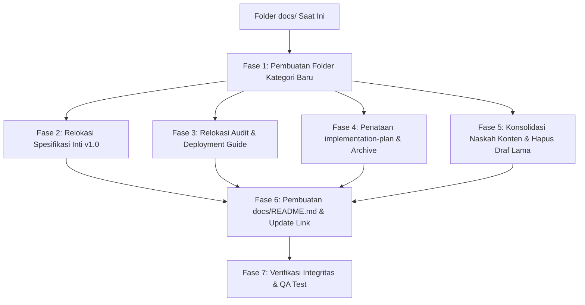

# 📋 Rencana Implementasi Restrukturisasi & Pembersihan Folder `docs/`
**Proyek:** Insani Indonesia (`insani.id`)  
**Target:** Penataan Dokumentasi Teknis, Audit, Panduan, dan Naskah Konten  
**Tanggal Rencana:** 4 Oktober 2026  
**Status:** PROPOSED / SIAP EKSEKUSI  

---

## 🎯 1. Tujuan & Sasaran

1. **Struktur yang Terorganisir:** Memisahkan dokumen arsitektur v1.0, audit, panduan operasional server, rencana implementasi, dan naskah konten ke dalam subfolder tematik yang jelas.
2. **Nir-Redudansi (Single Source of Truth):** Menghapus file draf lama yang sudah digantikan oleh dokumen revisi resmi (`fokus-program-insani.md`).
3. **Pemisahan Aktif vs Arsip:** Memindahkan rencana fase MVP yang sudah selesai (*shipped*) ke subfolder `archive/` sehingga tim fokus hanya pada rencana kerja yang sedang berjalan.
4. **Proteksi Ketergantungan Seeder:** Memastikan folder `docs/policy/` **tetap utuh** di jalurnya karena digunakan secara langsung oleh `database/seeders/PageSeeder.php`.
5. **Navigasi Terpusat:** Menyediakan satu file `docs/README.md` sebagai gerbang direktori indeks seluruh dokumentasi project.

---

## 🗺️ 2. Diagram Alur Restrukturisasi

---

## 📅 3. Rincian Fase Eksekusi

### Fase 1: Persiapan & Pembuatan Struktur Folder Baru
Membuat folder-folder kategori baru di dalam `docs/`:
- `docs/specifications/`
- `docs/audit/`
- `docs/audit/archive/`
- `docs/deployment/`
- `docs/implementation-plan/archive/`
- `docs/content/`
- `docs/content/archive/`

---

### Fase 2: Relokasi Dokumen Arsitektur & Spesifikasi Inti Sistem (v1.0)
Memindahkan 5 dokumen spesifikasi perancangan sistem ke `docs/specifications/`:
1. `docs/PRD_v1_0.md` ➔ `docs/specifications/PRD_v1_0.md`
2. `docs/ERD_v1_0.md` ➔ `docs/specifications/ERD_v1_0.md`
3. `docs/DATABASE_DICTIONARY_v1_0.md` ➔ `docs/specifications/DATABASE_DICTIONARY_v1_0.md`
4. `docs/API_SPEC_v1_0.md` ➔ `docs/specifications/API_SPEC_v1_0.md`
5. `docs/MODULE_BREAKDOWN_v1_0.md` ➔ `docs/specifications/MODULE_BREAKDOWN_v1_0.md`

---

### Fase 3: Relokasi Laporan Audit & Panduan Operasional Server
Memindahkan dokumen evaluasi teknis dan panduan operasional ke foldernya masing-masing:
1. **Ke `docs/audit/`:**
   - `docs/AUDIT_DAN_QA_PRE_DEPLOYMENT_HOSTINGER.md` ➔ `docs/audit/AUDIT_DAN_QA_PRE_DEPLOYMENT_HOSTINGER.md`
   - `docs/DEPLOYMENT_READINESS_AUDIT.md` ➔ `docs/audit/DEPLOYMENT_READINESS_AUDIT.md`
2. **Ke `docs/audit/archive/`:**
   - `docs/BACKEND_AUDIT_AND_TASKS.md` ➔ `docs/audit/archive/BACKEND_AUDIT_AND_TASKS.md` (Audit internal Agustus 2026)
3. **Ke `docs/deployment/`:**
   - `docs/HOSTINGER_DEPLOYMENT_GUIDE.md` ➔ `docs/deployment/HOSTINGER_DEPLOYMENT_GUIDE.md`
   - `docs/MANUAL_DATA_ENTRY_GUIDE.md` ➔ `docs/deployment/MANUAL_DATA_ENTRY_GUIDE.md`

---

### Fase 4: Penataan Folder Rencana Implementasi (`implementation-plan/`)
Merapikan rencana kerja teknis agar hanya memuat rencana aktif:
1. **Memindahkan rencana kerja yang tercecer di root:**
   - `docs/MIDTRANS_CORE_API_IMPLEMENTATION_PLAN.md` ➔ `docs/implementation-plan/MIDTRANS_CORE_API_IMPLEMENTATION_PLAN.md`
2. **Mengarsipkan rencana kerja MVP yang sudah selesai (*shipped*) ke `docs/implementation-plan/archive/`:**
   - `docs/implementation-plan/PHASE_1_IMPLEMENTATION.md`
   - `docs/implementation-plan/PHASE_2_IMPLEMENTATION.md`
   - `docs/implementation-plan/PHASE_8_IMPLEMENTATION.md`
   - `docs/implementation-plan/COMPANY_PROFILE_PHASE_1_IMPLEMENTATION.md`
   - `docs/implementation-plan/COMPANY_PROFILE_PHASE_2_IMPLEMENTATION.md`
3. **Mempertahankan rencana aktif:**
   - `docs/implementation-plan/PRE_DEPLOYMENT_FIXES_PLAN.md` (Tetap di root `implementation-plan/`)

---

### Fase 5: Konsolidasi Naskah Konten CMS & Pembersihan Redundansi
1. **Konsolidasi Naskah 6 Fokus Program:**
   - Hapus draf lama yang tidak terstruktur: `docs/fokus-program-insani.md`
   - Pindahkan dan ganti nama naskah revisi resmi yang menjadi rujukan `CategorySeeder.php`:
     `docs/fokus-program-insani-realita-vs-capaian.md` ➔ `docs/content/fokus-program-insani.md`
2. **Pengarsipan File Riset Biaya Payment Gateway:**
   - `docs/analisis-biaya-xendit-vs-midtrans.html` ➔ `docs/content/archive/analisis-biaya-xendit-vs-midtrans.html`

---

### Fase 6: Pembuatan Peta Navigasi `docs/README.md` & Pembaruan Referensi Link
1. **Buat file `docs/README.md`:**
   Menyediakan katalog terindeks yang menjelaskan struktur folder, deskripsi masing-masing dokumen, dan tautan langsung untuk mempermudah onboarding developer atau tim pengelola.
2. **Perbarui tautan markdown internal:**
   - Sesuaikan referensi link pada `docs/implementation-plan/PRE_DEPLOYMENT_FIXES_PLAN.md` dari `docs/AUDIT_DAN_QA_PRE_DEPLOYMENT_HOSTINGER.md` menjadi `docs/audit/AUDIT_DAN_QA_PRE_DEPLOYMENT_HOSTINGER.md`.

---

### Fase 7: Pengujian & Verifikasi Ketergantungan (QA)
1. **Verifikasi Seeder:**
   Jalankan pengecekan pada `PageSeeder` dan `CategorySeeder` untuk memastikan tidak ada jalur berkas (*file path*) yang terputus.
2. **Verifikasi Suite Test:**
   Jalankan `php artisan test --compact` untuk memastikan seluruh 482 tes tetap berstatus hijau / lulus 100%.

---

## 🛡️ 4. Matriks Mitigasi Risiko

| Potensi Risiko | Tingkat Risiko | Tindakan Pencegahan / Mitigasi |
|---|:---:|---|
| Seeder Halaman Publik Error | 🔴 Tinggi | Folder `docs/policy/` **TIDAK DISENTUH SAMA SEKALI**. Path `base_path('docs/policy/...')` di `PageSeeder.php` dijamin tetap valid. |
| Link Dokumentasi Rusak (*Broken Link*) | 🟡 Sedang | Audit dan perbarui seluruh link relatif yang merujuk antarfile markdown di `docs/`. |
| Kebingungan Tim Konten | 🟢 Rendah | Mengganti nama `fokus-program-insani-realita-vs-capaian.md` menjadi `fokus-program-insani.md` sehingga menjadi rujukan tunggal definitif. |

---

## ✅ 5. Checklist Verifikasi Akhir

- [ ] Folder kategori (`specifications`, `audit`, `deployment`, `content`, `archive`) terbuat.
- [ ] Dokumen spesifikasi v1.0 berada di `docs/specifications/`.
- [ ] Laporan audit berada di `docs/audit/`.
- [ ] Panduan deployment berada di `docs/deployment/`.
- [ ] File draf `fokus-program-insani.md` terhapus dan versi definitif berada di `docs/content/`.
- [ ] Rencana implementasi aktif terpisah dari arsip fase lama.
- [ ] Folder `docs/policy/` tetap berada di lokasi aslinya.
- [ ] File `docs/README.md` terbuat dan berfungsi sebagai katalog navigasi.
- [ ] Pest test suite lulus 100% tanpa error regresi.
