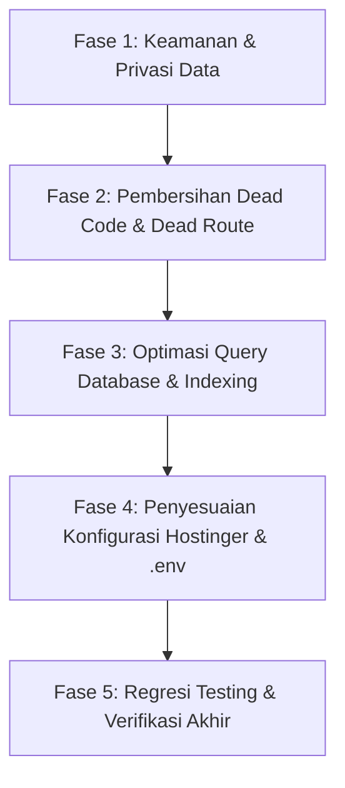

# 🛠️ Rencana Implementasi Perbaikan Pra-Deployment Hostinger
**Proyek:** Insani Indonesia (`insani.id`)  
**Target:** Hostinger Business Shared Hosting  
**Dasar Acuan:** [docs/audit/AUDIT_DAN_QA_PRE_DEPLOYMENT_HOSTINGER.md](file:///c:/laragon/www/insani-id/docs/audit/AUDIT_DAN_QA_PRE_DEPLOYMENT_HOSTINGER.md)  
**Tanggal:** 4 Oktober 2026  
**Status:** DRAFT / PROPOSED  

---

## 🎯 Tujuan Utama

Mengimplementasikan seluruh perbaikan dari hasil temuan audit pra-deployment secara terstruktur dan terukur, mencakup:
1. **Keamanan & Privasi Data:** Menutup kebocoran token rahasia Meta CAPI, memperketat `.htaccess`, dan konfigurasi Trusted Proxies.
2. **Integritas Routing & Dead Code:** Menghapus dead route `/settings/appearance` dan membersihkan file-file yang tidak relevan.
3. **Kinerja & Skalabilitas Kueri:** Mengoptimalkan query agregasi di detail program, dashboard multi-role, ekspor CSV hemat RAM (cursor streaming), dan penambahan missing database indexes.
4. **Konfigurasi Lingkungan Hostinger:** Memperbaiki template SMTP `.env.production.example` dan parameter session cookie.

---

## 📅 Rencana Fase Eksekusi



---

## 📌 Fase 1: Keamanan & Privasi Data (Prioritas Kritis)

### 1.1 Filter Kredensial Sensitif di Inertia Shared Props
- **File Target:** `app/Http/Middleware/HandleInertiaRequests.php`
- **Tindakan:**
  Ubah pengambilan `siteSettings` agar secara eksplisit mengecualikan key rahasia yang tidak boleh dikirim ke browser client (khususnya `meta_capi_access_token`).
- **Implementasi:**
  ```php
  'siteSettings' => Cache::remember('site_settings_public', 3600, function () {
      $hiddenKeys = ['meta_capi_access_token'];

      return AppSetting::whereNotIn('key', $hiddenKeys)
          ->pluck('value', 'key')
          ->toArray();
  }),
  ```
- **Verifikasi:**
  Buka halaman publik, periksa `data-page` pada atribut tag HTML `#app`, pastikan `meta_capi_access_token` bernilai `undefined` / tidak ada.

### 1.2 Konfigurasi Trusted Proxies
- **File Target:** `bootstrap/app.php`
- **Tindakan:**
  Daftarkan `$middleware->trustProxies(at: '*');` pada konfigurasi middleware web.
- **Tujuan:**
  Mencegah deteksi IP proxy internal Hostinger (172.x.x.x), mencegah salah deteksi HTTPS, serta memastikan validasi Turnstile dan rate limiting Fortify bekerja akurat per donatur.
- **Verifikasi:**
  Jalankan `php artisan test --compact` untuk memastikan tidak ada konflik middleware.

### 1.3 Penguatan Root `.htaccess` untuk Shared Hosting
- **File Target:** `.htaccess` (Root Proyek)
- **Tindakan:**
  Lengkapi aturan Apache rewrite dengan proteksi ketat `Deny from all` untuk:
  - File dotfiles (`.env*`, `.git*`)
  - File konfigurasi paket (`composer.json`, `composer.lock`, `package.json`, `package-lock.json`)
  - File skrip CLI (`artisan`)
  - Folder log dan penyimpanan internal (`storage/logs/`, `bootstrap/cache/`)
- **Implementasi:**
  ```apache
  # Block sensitive files from direct web access
  <FilesMatch "^(\.env|\.git|composer\.(json|lock)|package(-lock)?\.json|artisan|phpunit\.xml)$">
      Order allow,deny
      Deny from all
  </FilesMatch>

  <IfModule mod_rewrite.c>
      RewriteEngine On
      RewriteRule ^(.*)$ public/$1 [L]
  </IfModule>
  ```

---

## 📌 Fase 2: Pembersihan Dead Code & Dead Route (Prioritas Tinggi)

### 2.1 Hapus Dead Route `/settings/appearance`
- **File Target:** `routes/settings.php`
- **Tindakan:**
  Hapus baris 27:
  ```php
  Route::inertia('settings/appearance', 'settings/appearance')->name('appearance.edit');
  ```
- **Rasional:**
  File `appearance.tsx` tidak ada di `resources/js/pages/settings/` karena pergantian tema gelap/terang sudah ditangani secara instan di navbar atas oleh komponen `ThemeToggleButton.tsx`.

### 2.2 Hapus File yang Tidak Berkaitan (Dead Files)
- **Daftar File yang Dihapus:**
  1. `resources/js/pages/welcome.tsx` (42 KB - landing page template starter kit tak terpakai).
  2. `public/content/faq/faq-insani.md` (4,2 KB - draft FAQ teks lama tak terpakai).
  3. `docs/bug-layout/` (folder berisi 6 screenshot PNG debug layout lama: `bug-comment.png`, dll).
  4. `public/hot` (file penanda vite dev server lokal agar tidak terbawa ke hosting).
- **Verifikasi:**
  Jalankan `git status` untuk memverifikasi daftar file yang dibersihkan.

---

## 📌 Fase 3: Optimasi Query Database & Indexing (Prioritas Sedang/Tinggi)

### 3.1 Caching Agregasi Detail Program Publik
- **File Target:** `app/Http/Controllers/Public/ProgramListingController.php`
- **Tindakan:**
  Pada method `show(string $slug)`, ganti eksekusi berulang `donations()->where('status', 'paid')->sum('amount')` dan `sum('payments.gateway_fee')` dengan nilai kolom tersimpan `collected_amount` dan bungkus kalkulasi transparansi ke dalam cache berdurasi 60 detik (`Cache::remember`).
- **Dampak Positif:**
  Mengeliminasi 2 query agregat berat pada setiap kunjungan donatur ke halaman kampanye.

### 3.2 Optimasi Query Multi-Role Dashboard
- **File Target:** `app/Http/Controllers/DashboardController.php`
- **Tindakan:**
  1. Pindahkan 11 query agregasi global agar hanya dieksekusi saat `$isStaff === true`.
  2. Bungkus metrik ringkasan platform dengan `Cache::remember('dashboard_platform_stats', 300, ...)`.
  3. Donatur biasa (`$isDonor`) langsung diarahkan ke query personal donasi miliknya tanpa beban kalkulasi seluruh platform.

### 3.3 Streaming CSV Export (Cursor Streaming)
- **File Target:** `app/Http/Controllers/Admin/ReportController.php`
- **Tindakan:**
  Ganti `$query->get()` pada method `exportDonations` dan `exportDisbursements` dengan `$query->cursor()`.
- **Dampak Positif:**
  Mencegah crash memori PHP (`512MB memory exhaustion`) saat staf keuangan mengekspor puluhan ribu baris transaksi donasi.

### 3.4 Migration Penambahan Missing Index
- **Tindakan:**
  Buat migration baru: `php artisan make:migration add_performance_indexes_to_donations_and_payments_tables`
- **Index yang Ditambahkan:**
  - `donations`: `status`, `paid_at`, `donor_email`, `donor_user_id`
  - `payments`: `gateway_status`
  - `disbursements`: `status`
- **Verifikasi:**
  Jalankan `php artisan migrate` dan verifikasi skema database.

---

## 📌 Fase 4: Penyesuaian Konfigurasi Hostinger & .env

### 4.1 Pembaruan `.env.production.example`
- **File Target:** `.env.production.example`
- **Tindakan:**
  1. Koreksi skema SMTP port 465 menjadi:
     ```env
     MAIL_MAILER=smtp
     MAIL_HOST=smtp.hostinger.com
     MAIL_PORT=465
     MAIL_SCHEME=smtps
     ```
  2. Tambahkan variabel keamanan session:
     ```env
     SESSION_SECURE_COOKIE=true
     ```
  3. Berikan catatan panduan Cron Job Hostinger untuk eksekusi PHP 8.3 biner eksplisit.

---

## 📌 Fase 5: Regresi Testing & Verifikasi Akhir

### 5.1 Pengujian Otomatis (Pest Testing)
- Jalankan:
  ```bash
  php artisan test --compact
  ```
  Target: Seluruh 482 tes tetap lolos (477 passed, 5 skipped, 0 failed).

### 5.2 Standarisasi Format Kode (Laravel Pint)
- Jalankan:
  ```bash
  vendor/bin/pint --dirty --format agent
  ```
  Memastikan seluruh file PHP yang dimodifikasi mengikuti standar PSR-12 / Laravel Code Style.

### 5.3 Validasi Build Frontend Produksi
- Matikan dev server jika menyala, lalu jalankan:
  ```bash
  npm run build
  ```
  Pastikan bundle JavaScript dan CSS di folder `public/build/` sukses tanpa peringatan error komponen hilang.

---

## 📋 Checklist Eksekusi Bertahap

- [x] **Tugas 1 (Fase 1):** Sembunyikan `meta_capi_access_token` di `HandleInertiaRequests.php` (SELESAI)
- [x] **Tugas 2 (Fase 1):** Tambahkan `trustProxies(at: '*')` di `bootstrap/app.php` (SELESAI)
- [x] **Tugas 3 (Fase 1):** Perkuat aturan keamanan file di `.htaccess` (SELESAI)
- [x] **Tugas 4 (Fase 2):** Hapus route `/settings/appearance` di `routes/settings.php` (SELESAI)
- [x] **Tugas 5 (Fase 2):** Hapus file dead code (`welcome.tsx`, `faq-insani.md`, folder `docs/bug-layout/`, dan `public/hot`) (SELESAI)
- [x] **Tugas 6 (Fase 3):** Implementasi cursor streaming di `ReportController.php` (SELESAI)
- [x] **Tugas 7 (Fase 3):** Implementasi caching detail program & dashboard di `ProgramListingController.php` dan `DashboardController.php` (SELESAI)
- [x] **Tugas 8 (Fase 3):** Buat dan jalankan migration missing index database (SELESAI)
- [x] **Tugas 9 (Fase 4):** Perbarui konfigurasi `.env.production.example` (SELESAI)
- [x] **Tugas 10 (Fase 5):** Jalankan Pest test suite (482 tests, 0 failed) & Laravel Pint formatting (SELESAI)
- [x] **Tugas 11 (Fase 5):** Jalankan `npm run build` untuk memverifikasi packaging frontend (SELESAI)

---
*Status: SELURUH FASE PERBAIKAN TELAH SELESAI DIIMPLEMENTASIKAN & DIVERIFIKASI 100%.*
